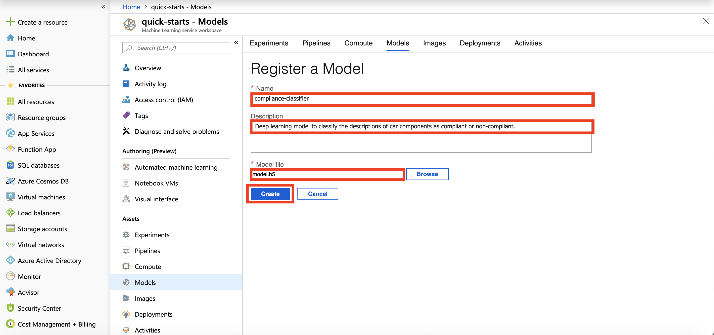

## Lab 12:  Register the Model

This lab explores the approaches you can take to managing the model versions, their association with Experiment Runs, and how you can retrieve the models both programmatically and via the Azure Portal.

This exercise is geared to a data scientist.  

### Discussion topics before we start this section  

1. 

## Steps

1. Browse to your Azure Notebooks project and navigate to `Register Model.ipynb`. 
1. Make sure you can see your model in the Azure Portal.  

You can also manually upload a model.  You would do this, for instance, if you have a pre-trained model you downloaded from the web.  Let's do that now with the model we downloaded.  

1.  Go to the Models section in AMLS workspace.  
1. Choose Add Model
1. **Ensure you name it identically to the name used in AzNotebooks**

   a. Name: `compliance-classifier`  
   b. Select the `model.h5` file from your local disk.

    'Register a Model Dialog'
   
> Note that you now have a **version 2** of the registered model: `compliance-classifier`.

