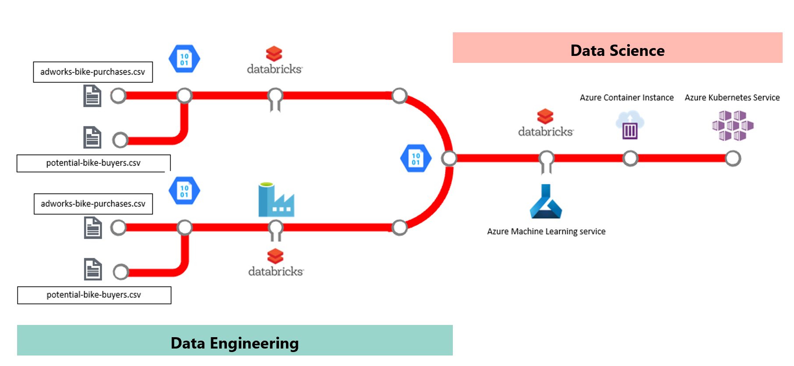

# MLOps End to End Workshop

https://github.com/davew-msft/MLOps-E2E

## What Technologies are Covered

* Databricks (dbx)
* Azure Machine Learning Service (AMLS)
* Azure Container Instances (ACI)
* Azure Kubernetes Service (AKS)
* Azure DevOps (AzDO)
* Jupyter Notebooks ([notebooks.azure.com](https://notebooks.azure.com))

## Target audience

-   Data Scientists
-   App Developers
-   AI Engineers
-   DevOps Engineers 
-   Anyone wanting to learn to think like a Data Scientist and take their analytics to the next level

The solution will look something like this:  

## Business Case Background

Our company sells bikes.  We have data about who does and does not buy bikes.  We'd like to use that data to build a predictive model to determine who will buy bikes in the future.  

On Day 2 of the workshop we'll look at the second part of the business use case...we want to look at our specifications documents and determine if they are compliant or not with bicycle industry regulations (work with me on this use case).  We are going to build an MLOps solution that uses Deep Learning against the specifications text to determine if we are in compliance.  

## Workshop Objectives

In this workshop, you will learn how to:

* use the az cli to deploy resources to Azure
* setup and configure Azure Databricks for analytics
* setup and configure Azure ML Services to integrate your data science work into your DevOps pipelines.  
* *Think Like a Data Scientist*

## Workshop Agenda

1. [Lab 1:  Setup the resources needed for this workshop](Lab1/README.md)
1. [Lab 2:  Learn about Azure Machine Learning Services](Lab2/README.md)
1. [Lab 2a: Getting Databricks Ready for DevOps/MLOps](Lab2a/README.md)
1. [Lab 3:  Build and Deploy an ML Model](Lab3/README.md)  

Alternate Labs:  

1. Load data to ADLS2 with ADF and Databricks

## Day 2 Agenda - DevOps/MLOps in Depth

We are going to build the DL/NLP model to look at their specification documents.  We'll use Jupyter notebooks, AMLS, and AzDO to manage the MLOps pipelines.  This will build on Day 1 by adding in AzDO Pipelines concepts.  We'll determine how to retrieve the best model, package it with a WebApp, and deploy an inferencing web service.  Then we'll figure out how to monitor the model's performance after it is deployed (on AKS).  Our model will be deployed as ONNX format, which means it can be run on the Edge or anywhere else.  

We are going to build something that looks similar to this:  

The overall approach used in this lab is to orchestrate continuous integration and continuous delivery Azure Pipelines from Azure DevOps. These pipelines are triggered by changes to artifacts that describe a machine learning pipeline, that is created with the Azure Machine Learning SDK. In the lab, you make a change to the model training script that executes the Azure Pipelines Build Pipeline, which trains the model and creates the container image. Then this triggers an Azure Pipelines Release pipeline that deploys the model as a web service to AKS, by using the Docker image that was created in the Build pipeline. Once in production, the scoring web service is monitored using a combination of Application Insights and Azure Storage.

**Day 2 has only a few dependencies on Day 1 workshop.  Make sure you run Lab 1 above and you should be fine**

These labs can be divided between data scientists and DevOps engineers.  

These tasks are geared toward data scientists:  

1. [Lab10:  Setup](Lab10/README.md)
1. [Lab11:  Create a Classifier Model](Lab11/README.md)
1. [Lab12:  Register the Model](Lab12/README.md)

These tasks are geared toward DevOps engineers and can be down in parallel with the tasks above, if desired.  

1. [Lab20:  Setup AzDO](Lab20/README.md)

This task should be done by both the data scientist and DevOps engineer:  

1. [Lab21:  Setup and Run a Build Pipeline](Lab21/README.md)
1. [Lab22:  Setup and Run a Release Pipeline](Lab22/README.md)
1. [Lab23:  Test Our Pipelines](Lab23/README.md)
1. [Lab24:  Monitoring Model Performance](Lab24/README.md)

## WrapUp

1. **Remove the RG you created to prevent incurring Azure costs**

